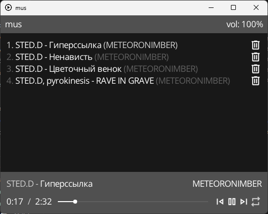

> [!WARNING]
> This software was rewritten and this version is abandoned. Visit [mus2](https://github.com/thisisignitedoreo/mus2) for more info.

# mus
Simple, from-scratch music player written in c99 and raylib

## Quickstart
```shell
$ python bundle.py
$ make mus _NO_CONSOLE=ON
# NOTE: you can omit _NO_CONSOLE flag to enable debug console
```

## Gallery
<br/>
_mus with some tracks in the playlist_

<br/>
_mus with opened album page_

## Thanks to
- @raysan5 for the amazing raylib library
- @larsbs for ID3v2lib
- @daleonov for a fork of ID3v2lib with some fixes
- @googlefonts for a font for this app (OpenSans)
- @google for all the icons for this app
